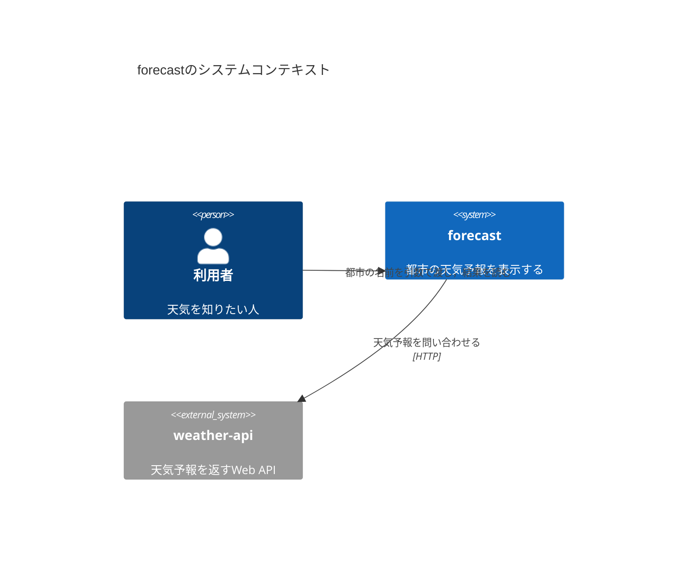
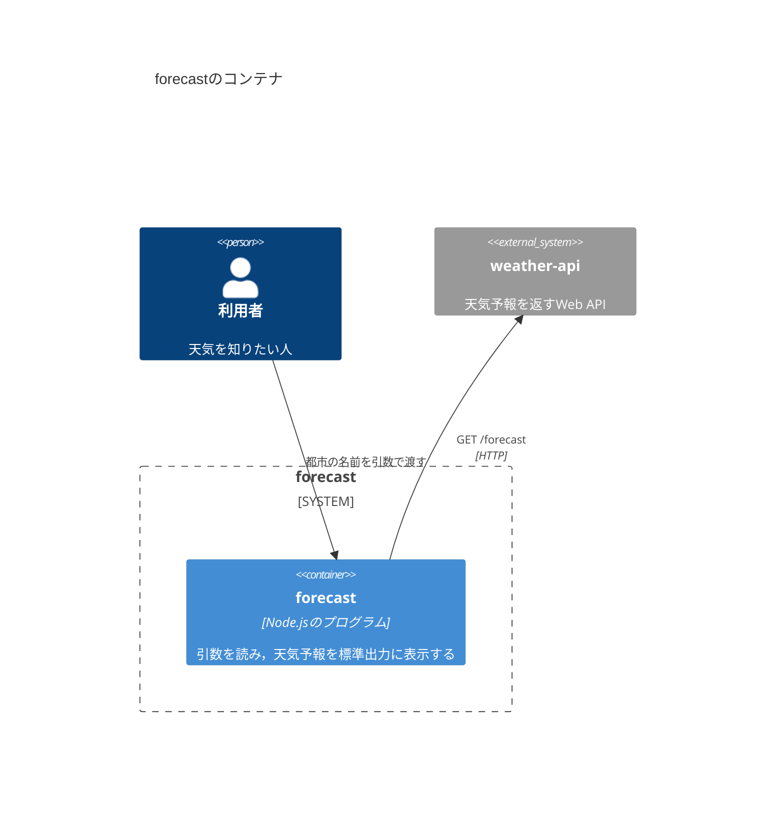
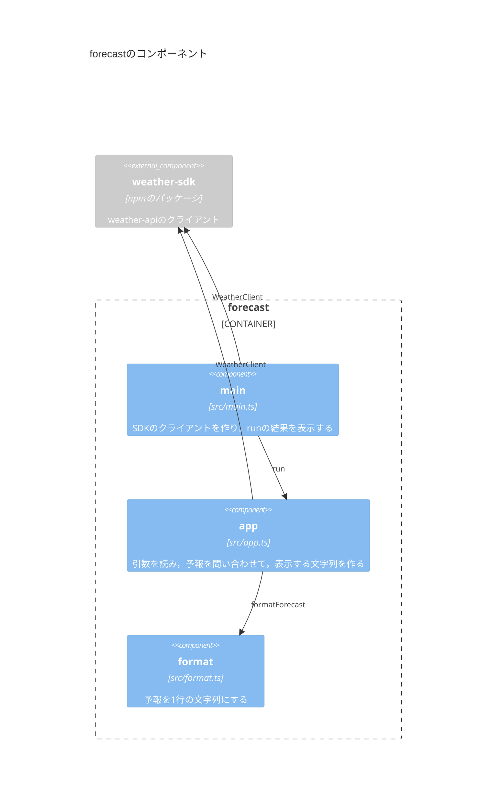
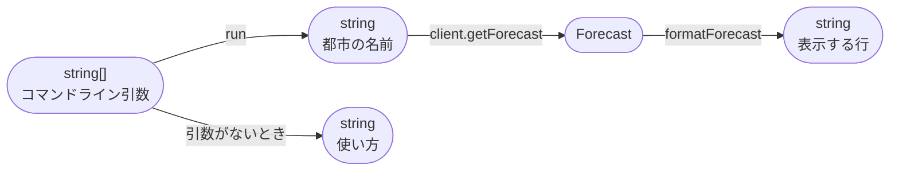
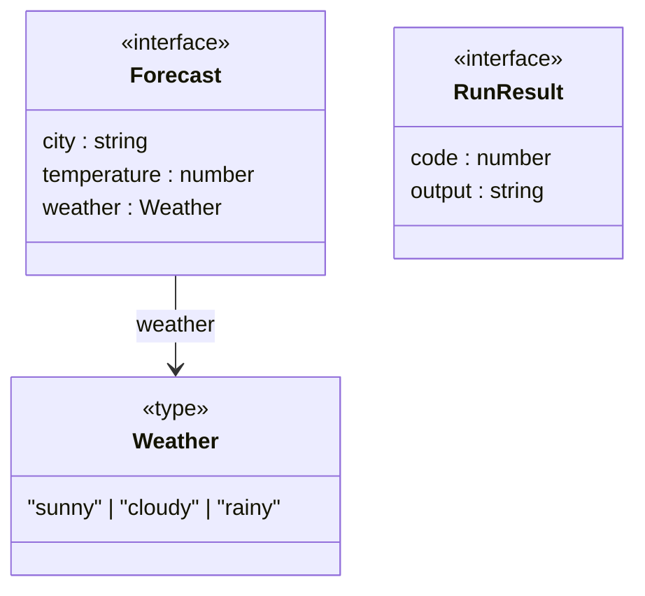
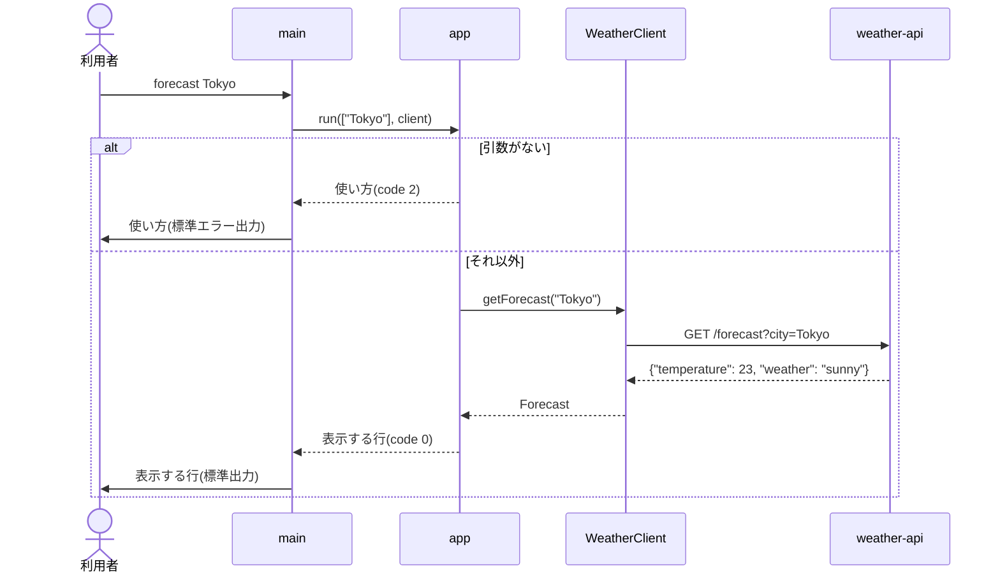

# 設計書の書き方

このハンズオンでは，実装の前に設計書を書き，実装したあとで設計書を見直す．
設計書は，システムの構成をmermaidの図で表したMarkdownのファイルである．
各パッケージの`design/`に置き，Iterationごとに同じ設計書を育てていく．

## 設計と実装のループ

各Iterationは，次の順に進める．

1. テストリストを書く：要求を読み，満たすべき振る舞いを単体テストと結合テストのテストリストにする([tdd.md](tdd.md))．
2. 設計書を更新する：テストリストの振る舞いを実現するために，どの型・関数・モジュールを足したり変えたりするかを決め，設計書の図に描く．
3. 実装する：テストリストの項目を1つずつRed→Greenにする．設計書に描いた型と関数を作っていく．
4. 設計書を見直す：実装してみて設計と変わったところがあれば，設計書を実装に合わせて直す．

テストリストは「何ができればよいか(振る舞い)」を，設計書は「それをどんな部品の組み合わせで作るか(構造)」を表す．
設計書の図に描いた関数は，テストリストのどの項目で確かめるのかを，行き来しながら確かめる．

## 設計書の構成

設計書は，[C4モデル](https://c4model.com/)の4つの階層と，呼び出しの順序を表すシーケンス図の，5つのファイルに分ける．
C4モデルは，ソフトウェアの構成を，地図を拡大するように4段階の粒度で描く方法である．

| ファイル | 階層 | 描くもの | このハンズオンでの中身 |
| --- | --- | --- | --- |
| `design/01-context.md` | Context | システムと，それを使う人や外部のシステム | 利用者，`triage`，判断エンジン |
| `design/02-container.md` | Container | システムを構成する，別々に動くもの・データの置き場所 | `triage`の実行ファイル，Ollama，ファイル |
| `design/03-component.md` | Component | 1つのコンテナの中の部品と，その依存関係 | `src/`のモジュールと，使う外部のパッケージ |
| `design/04-code.md` | Code | 部品の中身 | 型と関数の流れ，主な型 |
| `design/05-sequence.md` | シーケンス | 1つの使い方の中で，だれがだれをどの順に呼ぶか | 入口から判断エンジンまでの呼び出し |

### 書くときの決まり

- 図の中の名前(モジュール名・型名・関数名)は，実装の名前と一致させる．
- 1つの図には1つの観点だけを描く．
- 図の上に，何を表す図かを1〜2文で書く．図だけでは伝わらない決めごと(エラーの扱い，しきい値など)は，図の下に箇条書きで書く．
- その時点のシステムの姿だけを描く．後のIterationで作るものは描かない．

## 各階層の書き方

例として，都市の名前を渡すと天気予報を表示するコマンド`forecast`の設計書を示す．
`forecast`は，天気予報のWeb API(`weather-api`)にHTTPで問い合わせ，その結果を1行にまとめて表示する．

```console
$ forecast Tokyo
Tokyo: 23°C, sunny
```

### Context(`01-context.md`)

`C4Context`の図で，システムを使う人(`Person`)・システム(`System`)・外部のシステム(`System_Ext`)と，その関係(`Rel`)を描く．



- `Person(名前, "表示名", "説明")`，`System(名前, "表示名", "説明")`．名前は図の中で参照するための英数字の識別子である．
- `Rel(元, 先, "説明")`で関係を矢印にする．4つ目の引数に，通信の方式などの技術を書ける．

### Container(`02-container.md`)

`C4Container`の図で，システムの境界(`System_Boundary`)の中に，別々に動くもの(`Container`)とデータの置き場所(`ContainerDb`)を描く．



- `Container(名前, "表示名", "技術", "説明")`．
- ファイルやデータベースは`ContainerDb(名前, "表示名", "形式", "説明")`で描く．
- `src/`のモジュールは実行ファイルの中に組み込まれるので，コンテナではなくComponentの階層で描く．

### Component(`03-component.md`)

`C4Component`の図で，1つのコンテナ(`Container_Boundary`)の中のモジュール(`Component`)と，モジュールの依存関係を描く．
外部のパッケージは，境界の外に`Component_Ext`で描く．



- `Component(名前, "モジュール名", "ファイル", "役割")`．モジュール名は，`src/`からの相対パスから拡張子を除いたもの(`app`，`adapters/fake-engine`など)にする．
- `Component_Ext(名前, "パッケージ名", "種類", "役割")`．パッケージ名は，`import`に書く名前(`@typesafe-ai/sdk`など)にする．
- `Rel`の矢印は「使う側から使われる側へ」向け，説明には使う関数や型の名前を書く．
- どのモジュールがどのモジュールやパッケージを`import`しているかと，図の矢印を一致させる．型だけの`import type`も矢印にする．`node:`で始まるNodeの組み込みモジュールは描かない．

### Code(`04-code.md`)

Codeの階層には，型と関数の流れと，主な型の2種類の図を描く．

#### 型と関数の流れ

`flowchart`で，型をノード，関数を矢印にして，入力から出力までの変換を描く．
ノードは`名前(["型"])`(角の丸い箱)で書き，矢印のラベルに関数を書く．



- 矢印は`ノード -- "ラベル" --> ノード`，点線の矢印は`ノード -. "ラベル" .-> ノード`と書く．
- 条件によって別の結果になるときは，それぞれの結果のノードに矢印を引き，ラベルに条件を書く．
- `<br/>`で，ノードの中で改行できる．
- 非同期の関数(`Promise`を返す関数)も，`await`したあとの型をノードにする．

#### 主な型

`classDiagram`で，自分で定義した型と，型どうしの関係を描く．
`<<…>>`で，型の種類(`interface`，`type`，定数)を書く．



- `interface`やオブジェクトの`type`はプロパティを，ユニオン型は取りうる値を並べる．
- `A --> B : プロパティ名`は「AのプロパティがBの型を持つ」ことを表す．
- インターフェースを実装するクラスやオブジェクトは，`インターフェース <|.. 実装`で描く．

### シーケンス(`05-sequence.md`)

`sequenceDiagram`で，1つの使い方の中で，だれがだれをどの順に呼ぶかを描く．
HTTPの通信は，送るリクエストと返ってくるレスポンスがわかるように描く．



- `participant 名前 as 表示名`，`actor 名前 as 表示名`で登場するものを並べる．
- `A->>B: 説明`は呼び出し，`A-->>B: 説明`は結果を返すことを表す．
- `alt 条件 … else 条件 … end`で場合分けを，`par … and … end`で並行して行う処理を描く．

## 図を確かめる

- VSCodeでMarkdownのファイルを開き，`Ctrl+Shift+V`(macOSでは`Cmd+Shift+V`)でプレビューを表示すると，図が描かれる．
- `mise run lint`は，すべてのMarkdownのファイルのmermaidの図を，構文として読めるか検査する．コミット時にも，ステージしたMarkdownのファイルが検査される．
- 1つのファイルだけを検査するときは，リポジトリの直下で`node tools/mermaid/check.mjs <ファイル>`を実行する．
- Componentの図の矢印が実装の`import`と一致しているかは，`node tools/check-component.mjs <パッケージのディレクトリ>`で確かめる．

mermaidの書き方の詳細は，[mermaidのドキュメント](https://mermaid.js.org/intro/)の各図の節を参照する．
