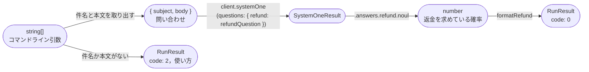
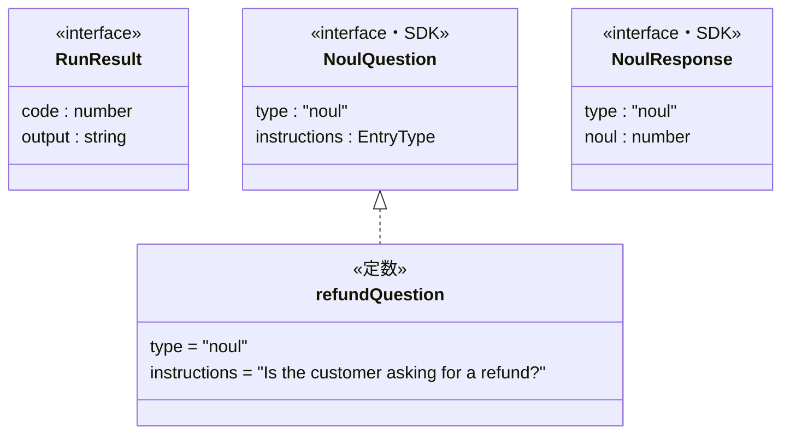

# Code：型と関数

モジュールの中の型と関数を示す．

## 型と関数の流れ

コマンドライン引数から表示する文字列までを，型の変換の流れで示す．

- 確率が0.5以上なら`yes`，それ以外は`no`と表示する．確率は小数第2位までに丸める．

## 主な型

自分で定義した型と，使う外部の型を示す．

- `NoulQuestion`と`NoulResponse`は，SDK(`@typesafe-ai/sdk`)の型である．`NoulResponse`は，`result.answers.refund`の型である．
