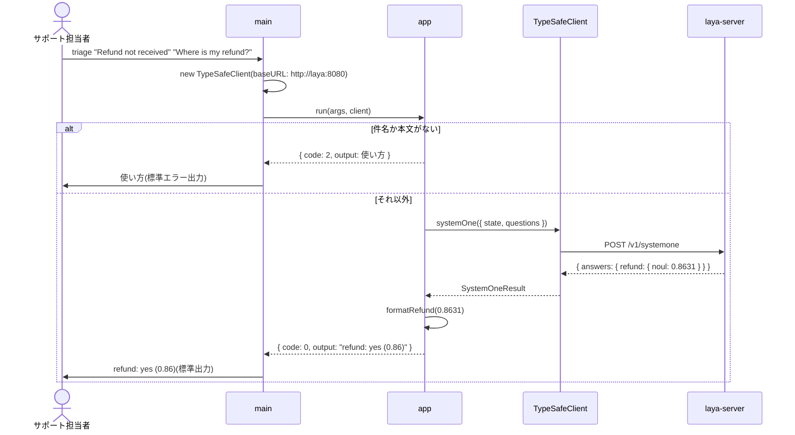

# シーケンス：呼び出しの順序

利用者が`triage`を実行してから結果が表示されるまでの，呼び出しの順序を示す．

```mermaid
sequenceDiagram
  actor user as サポート担当者
  participant main as main
  participant app as app
  participant client as TypeSafeClient
  participant engine as laya-server
  user->>main: triage "Refund not received" "Where is my refund?"
  main->>main: new TypeSafeClient(baseURL: http://laya:8080)
  main->>app: run(args, client)
  alt 件名か本文がない
    app-->>main: { code: 2, output: 使い方 }
    main->>user: 使い方(標準エラー出力)
  else それ以外
    app->>client: systemOne({ state, questions })
    client->>engine: POST /v1/systemone
    engine-->>client: { answers: { refund: { noul: 0.8631 } } }
    client-->>app: SystemOneResult
    app->>app: formatRefund(0.8631)
    app-->>main: { code: 0, output: "refund: yes (0.86)" }
    main->>user: refund: yes (0.86)(標準出力)
  end
```
