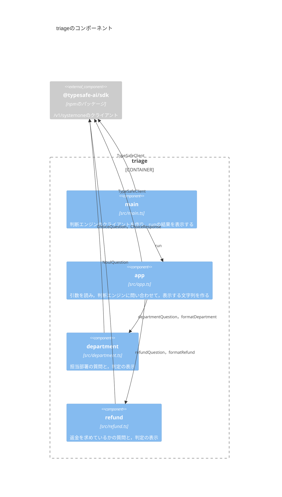

# Component：モジュール

`triage`を構成するモジュール(`src/`のファイル)と，使う外部のパッケージと，その依存関係を示す．

```mermaid
C4Component
  title triageのコンポーネント
  Container_Boundary(cli, "triage") {
    Component(main, "main", "src/main.ts", "判断エンジンのクライアントを作り，runの結果を表示する")
    Component(app, "app", "src/app.ts", "引数を読み，判断エンジンに問い合わせて，表示する文字列を作る")
    Component(department, "department", "src/department.ts", "担当部署の質問と，判定の表示")
    Component(refund, "refund", "src/refund.ts", "返金を求めているかの質問と，判定の表示")
  }
  Component_Ext(sdk, "@typesafe-ai/sdk", "npmのパッケージ", "/v1/systemoneのクライアント")
  Rel(main, app, "run")
  Rel(main, sdk, "TypeSafeClient")
  Rel(app, department, "departmentQuestion，formatDepartment")
  Rel(app, refund, "refundQuestion，formatRefund")
  Rel(app, sdk, "TypeSafeClient")
  Rel(department, sdk, "ChoiceQuestion，ChoiceResponse")
  Rel(refund, sdk, "NoulQuestion")
```

- `main`だけが，接続先のURLを知っている．`app`は，渡されたクライアントを使う．
