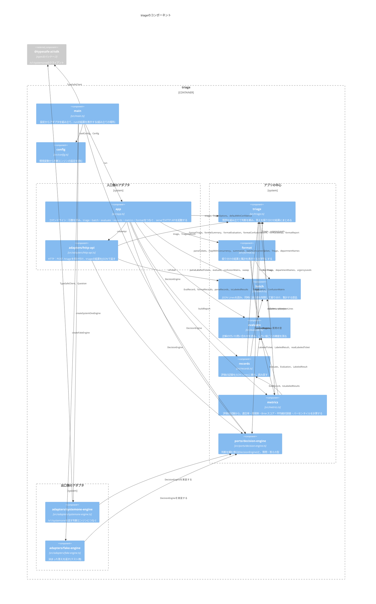

# Component：モジュール

`triage`を構成するモジュール(`src/`のファイル)と，使う外部のパッケージと，その依存関係を示す．

- アプリの中心(`triage`・`format`・`batch`・`evaluate`・`records`・`metrics`・`ports/decision-engine`)は，SDKとアダプタのどちらにも依存しない．
- ファイルを読み書きするのは`app`である．`batch`・`evaluate`・`records`は，ファイルの中身(文字列)を受け取るか返す．
- `metrics`は，記録だけから指標を計算する．判断エンジンを使わない．
- アダプタは，ポートの`DecisionEngine`を実装する．依存の矢印は，アダプタからポートへ向く(依存性の逆転)．
- 入口側のアダプタ(`app`・`adapters/http-api`)は，外からの頼みごと(コマンドライン・HTTP)をアプリの中心の呼び出しに変える．出口側のアダプタ(`adapters/systemone-engine`・`adapters/fake-engine`)は，アプリの中心の頼みごとを外の仕組みの呼び出しに変える．
- コマンドラインとHTTP APIは，同じ`triage`を使う．
- どの出口側のアダプタを使うかを決めるのは`main`だけである．`main`は，`config`が読んだ設定に従ってアダプタを作る．
- `adapters/fake-engine`は，テストと，`DECISION_ENGINE=fake`のときに使う．
- `config`は，ほかのモジュールに依存しない．
