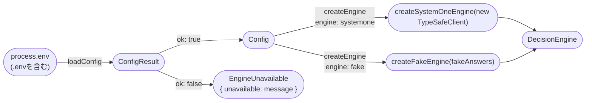
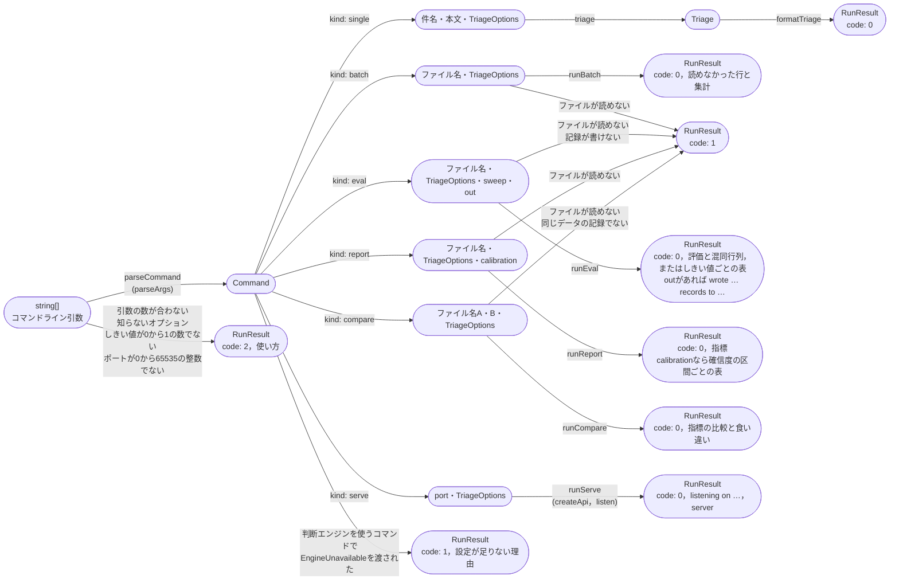
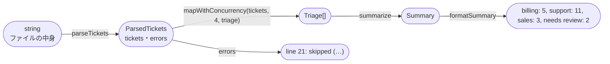
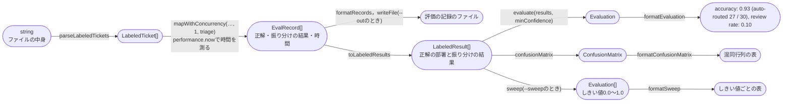
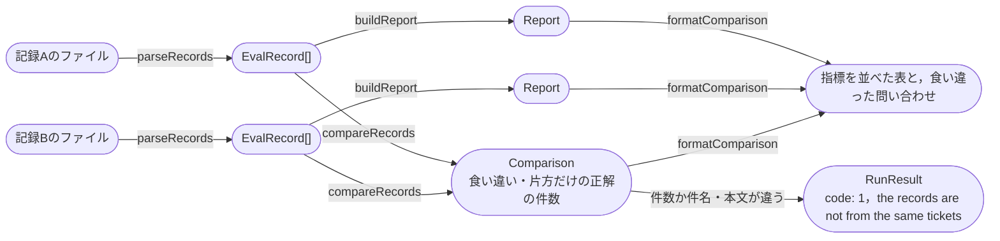
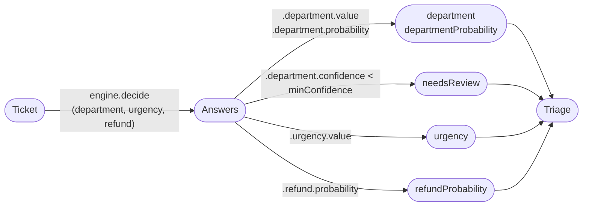
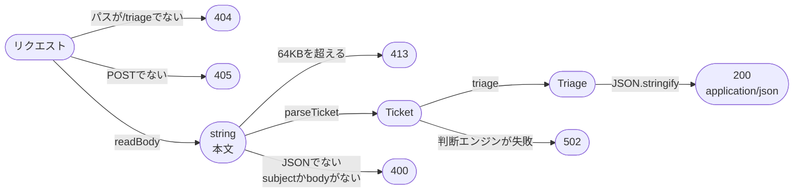

# Code：型と関数

モジュールの中の型と関数を示す．

## 型と関数の流れ

`main`は，環境変数から判断エンジンを組み立てる．

- `run`には，`DecisionEngine`か，設定が足りない理由(`EngineUnavailable`)を渡す．`report`・`compare`は判断エンジンを使わないので，理由を渡されても実行する．ほかのコマンドは，理由を標準エラー出力に表示して，終了コード1で終わる．

- `DECISION_ENGINE`がないときは`systemone`とする．`systemone`のときは，`SYSTEMONE_BASE_URL`・`SYSTEMONE_MODEL`・`SYSTEMONE_API_KEY`がすべて必要である．空の値は，ないものとして扱う．
- `SYSTEMONE_TIMEOUT_MS`は省略できる．あれば正の整数でなければならず，`TypeSafeClient`の`timeout`に渡す．なければSDKの既定(10秒)を使う．

コマンドライン引数から表示する文字列までを，型の変換の流れで示す．

`runBatch`は，ファイルの中身から集計までを次のように作る．

- 空の行は飛ばす．JSONとして読めない行や，`subject`と`body`が文字列でない行は，行番号とともに知らせて飛ばす．
- 判断エンジンには，同時に`batchConcurrency`(4)件まで送る．結果は，ファイルの順に並べる．
- 集計では，人の確認に回したものを部署の件数に含めない．部署は`departmentNames`の順に並べる．

`runEval`は，正解の付いた問い合わせから，評価を次のように作る．

- 自動で振り分けたとみなすのは，部署の確信度(`departmentConfidence`)がしきい値以上のものである．正解率は，そのうち部署が正解だった割合である．自動で振り分けたものがなければ，正解率は`n/a`と表示する．
- 混同行列は，人の確認に回すものも含めて，すべての問い合わせを数える．
- `--sweep`と`--min-confidence`は一緒に使えない．`--sweep`と`--out`は`eval`でだけ使える．
- 正解の付いた問い合わせは，`department`(`departmentNames`のどれか)・`refund`(真偽値)・`urgency`(0から3の整数)をすべて持つ．
- `--out`のファイルを置くディレクトリがなければ作る．

`runReport`は，評価の記録から指標を次のように作る．判断エンジンには尋ねない．

`buildReport`は，次の指標をまとめる．割る数が0のときなど，求められない指標は`undefined`にし，`n/a`と表示する．

| 指標 | 関数 | 求め方 |
| --- | --- | --- |
| 部署の正解率・人の確認に回る割合 | `evaluate` | Iteration 7と同じ |
| 部署ごとの適合率 | `precisionRecall` | その部署と判定したもののうち，正解もその部署だった割合 |
| 部署ごとの再現率 | `precisionRecall` | 正解がその部署のもののうち，その部署と判定した割合 |
| 返金の正解率 | `refundMetrics` | 確率0.5以上を「返金を求めている」としたときの正解の割合 |
| 返金のBrierスコア | `refundMetrics` | 確率と正解(1か0)の差の2乗の平均 |
| 緊急度の平均絶対誤差 | `meanAbsoluteError` | 期待値と正解の段階の差の絶対値の平均 |
| 所要時間の中央値・95パーセンタイル | `percentile` | 小さい順に並べ，50%・95%の位置にある値(最近順位法) |

- 適合率と再現率は，人の確認に回すものも含めて，すべての記録で求める．
- `--calibration`のときは，`calibration`で部署の確信度を0.2刻みの5つの区間に分け，区間ごとの件数・確信度の平均・正解率を表にする．区間は下端を含み上端を含まない．確信度1は最後の区間に入れる．`--calibration`は`report`でだけ使える．

`runCompare`は，2つの記録を次のように比べる．判断エンジンには尋ねない．

- 2つの記録は，同じ位置の問い合わせどうしで突き合わせる．件数か，同じ位置の件名と本文が違えば，同じデータの記録ではないとして比べない．
- 食い違いは，部署の判定がAとBで違う問い合わせである．どちらも誤っていて判定が違うものも含める．

`triage`の中では，アプリの質問を`DecisionEngine`に渡し，答えから`Triage`を作る．

`adapters/systemone-engine`は，アプリの質問と答えを，`/v1/systemone`の質問と答えに変換する．

- `formatTriage`は，`Triage`の項目ごとに1行を作り，改行でつなぐ．`needsReview`なら，部署の行の末尾に空白と`-> needs review`を付ける．
- しきい値(`minConfidence`)は，`--min-confidence`で指定する．指定しなければ`defaultMinConfidence`(0.3)を使う．確信度がしきい値ちょうどなら，人の確認に回さない．
- 緊急度は，期待値を四捨五入した番号の段階の名前と，期待値を小数第1位まで表示する．返金は，確率が0.5以上なら`yes`とする．確率は小数第2位までに丸める．

`adapters/http-api`は，HTTPのリクエストを次のように処理する．

- エラーのときは，`{"error": "理由"}`を返す．
- 返すJSONは，`Triage`の項目をそのまま並べたものである．表示用の書式(`format`)は使わない．

## 主な型

ポート(`ports/decision-engine`)の型と，アプリの型を示す．

```mermaid
classDiagram
  class DecisionEngine {
    <<interface>>
    decide(state, questions) Promise~Answers~
  }
  class ChoiceQuestion {
    <<interface>>
    kind : "choice"
    prompt : string
    options : Record~string, string~
  }
  class ScaleQuestion {
    <<interface>>
    kind : "scale"
    prompt : string
    levels : string[]
  }
  class YesNoQuestion {
    <<interface>>
    kind : "yesno"
    prompt : string
  }
  class ChoiceAnswer {
    <<interface>>
    kind : "choice"
    value : string
    probability : number
    confidence : number
    probabilities : Record~string, number~
  }
  class ScaleAnswer {
    <<interface>>
    kind : "scale"
    value : number
    confidence : number
    probabilities : number[]
  }
  class YesNoAnswer {
    <<interface>>
    kind : "yesno"
    probability : number
  }
  class FakeEngine {
    <<interface>>
    calls : FakeEngineCall[]
  }
  class ParsedTickets {
    <<interface>>
    tickets : Ticket[]
    errors : string[]
  }
  class LabeledTicket {
    <<interface>>
    subject : string
    body : string
    department : string
    refund : boolean
    urgency : number
  }
  class EvalRecord {
    <<interface>>
    ticket : LabeledTicket
    result : Triage
    elapsedMs : number
  }
  class Report {
    <<interface>>
    evaluation : Evaluation
    departments : Record~string, PrecisionRecall~
    refund : RefundMetrics
    urgencyError : number | undefined
    latency : median・p95
  }
  class CalibrationBin {
    <<interface>>
    lower : number
    upper : number
    count : number
    meanConfidence : number | undefined
    accuracy : number | undefined
  }
  class Comparison {
    <<interface>>
    differences : Difference[]
    onlyA : number
    onlyB : number
  }
  class Difference {
    <<interface>>
    subject : string
    actual : string
    a : string
    b : string
  }
  class PrecisionRecall {
    <<interface>>
    precision : number | undefined
    recall : number | undefined
  }
  class RefundMetrics {
    <<interface>>
    accuracy : number | undefined
    brierScore : number | undefined
  }
  class Evaluation {
    <<interface>>
    minConfidence : number
    total : number
    autoRouted : number
    correct : number
    accuracy : number | undefined
    reviewRate : number
  }
  class ConfusionMatrix {
    <<type>>
    Record~正解の部署, Record~判定した部署, 件数~~
  }
  class Summary {
    <<interface>>
    departments : Record~string, number~
    needsReview : number
  }
  class Config {
    <<type>>
    engine : "systemone" | "fake"
    baseURL : string
    model : string
    apiKey : string
    timeoutMs : number | undefined
  }
  class ConfigResult {
    <<type>>
    ok : true，config : Config
    ok : false，message : string
  }
  class TriageOptions {
    <<interface>>
    minConfidence? : number
  }
  class Triage {
    <<interface>>
    department : string
    departmentProbability : number
    departmentConfidence : number
    needsReview : boolean
    urgency : number
    refundProbability : number
  }
  ConfigResult --> Config : config
  Ticket <|-- LabeledTicket
  EvalRecord --> LabeledTicket : ticket
  EvalRecord --> Triage : result
  Report --> Evaluation : evaluation
  Report --> PrecisionRecall : departments
  Report --> RefundMetrics : refund
  Comparison --> Difference : differences
  DecisionEngine <|-- FakeEngine
  DecisionEngine <|.. createSystemOneEngine : 作るオブジェクト
  ChoiceQuestion ..> ChoiceAnswer : AnswerFor
  ScaleQuestion ..> ScaleAnswer : AnswerFor
  YesNoQuestion ..> YesNoAnswer : AnswerFor
```

- `Answers<Q>`は，質問の名前ごとに，その質問の種類に対応する答え(`AnswerFor`)を持つ型である．
- `Config`は，`engine`が`systemone`のときだけ`baseURL`・`model`・`apiKey`を持つ．
- `Ticket`・`urgencyLevels`は，Iteration 2と同じである．`RunResult`は，`serve`のときに待ち受けている`server`(`node:http`の`Server`)も持つ．
- `app`の中の`Command`は，`parseCommand`が引数から作る，件名・本文・`TriageOptions`の組である．
