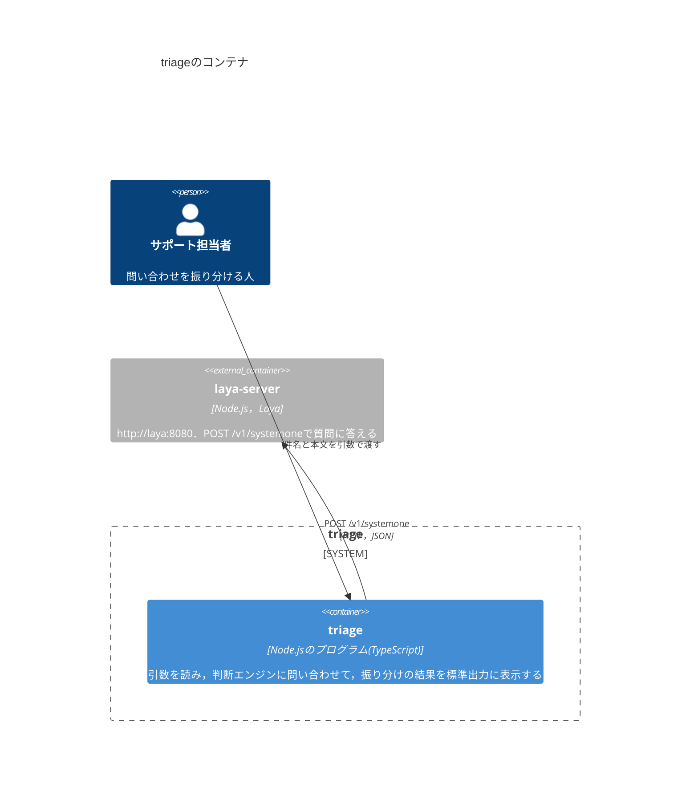

# Container：コンテナ

`triage`を構成する，別々に動くものとデータの置き場所を示す．

```mermaid
C4Container
  title triageのコンテナ
  Person(user, "サポート担当者", "問い合わせを振り分ける人")
  System_Boundary(system, "triage") {
    Container(cli, "triage", "Node.jsのプログラム(TypeScript)", "引数を読み，判断エンジンに問い合わせて，振り分けの結果を標準出力に表示する")
  }
  Container_Ext(engine, "laya-server", "Node.js，Laya", "http://laya:8080．POST /v1/systemoneで質問に答える")
  Rel(user, cli, "件名と本文を引数で渡す")
  Rel(cli, engine, "POST /v1/systemone", "HTTP，JSON")
```

- `triage`は，実行するたびに1回だけ判断エンジンに問い合わせる．担当部署・緊急度・返金の3つの質問は，同じリクエストで送る．
