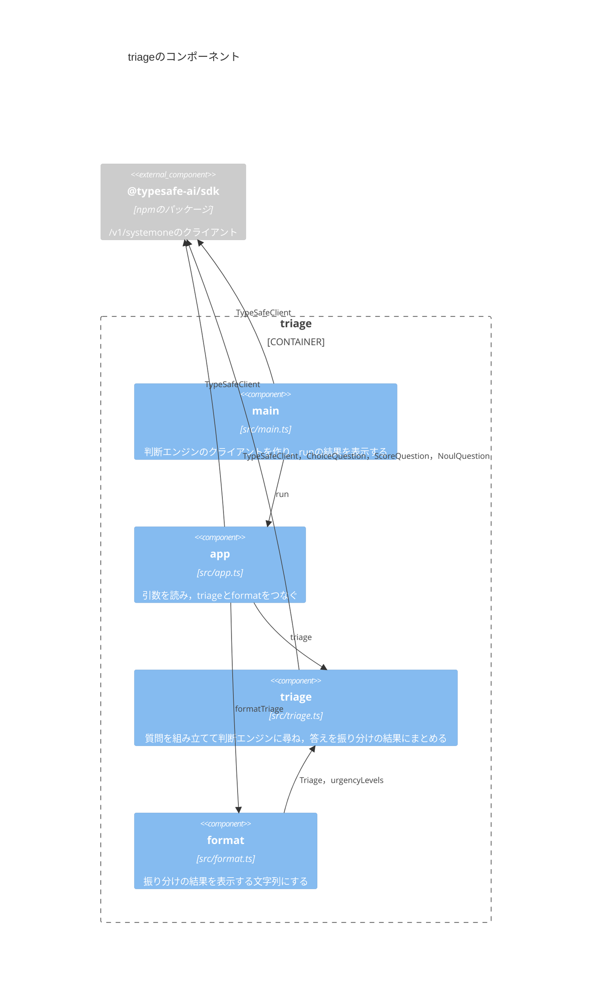

# Component：モジュール

`triage`を構成するモジュール(`src/`のファイル)と，使う外部のパッケージと，その依存関係を示す．

- `main`だけが，接続先のURLを知っている．`app`は，渡されたクライアントを`triage`に渡す．
- 判断エンジンとやりとりするのは`triage`だけである．`format`は，判断エンジンの答えの形(SDKの型)を知らず，`Triage`だけを表示する．
