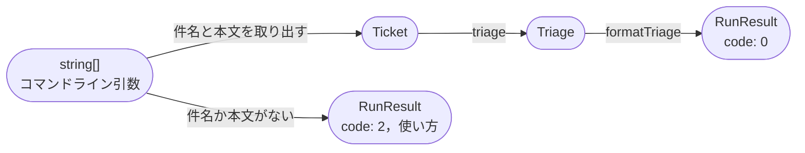
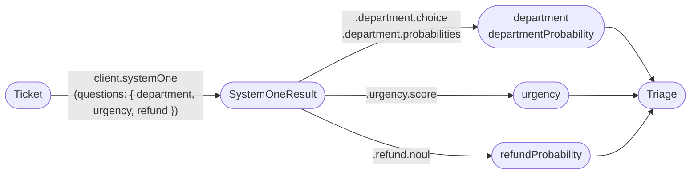
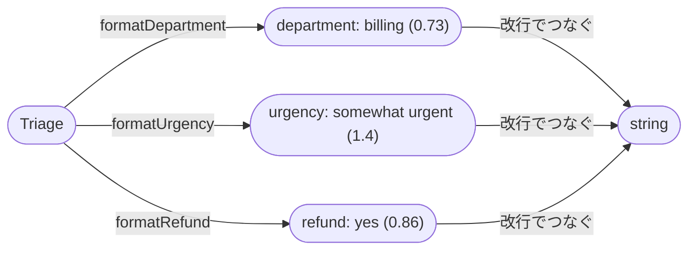
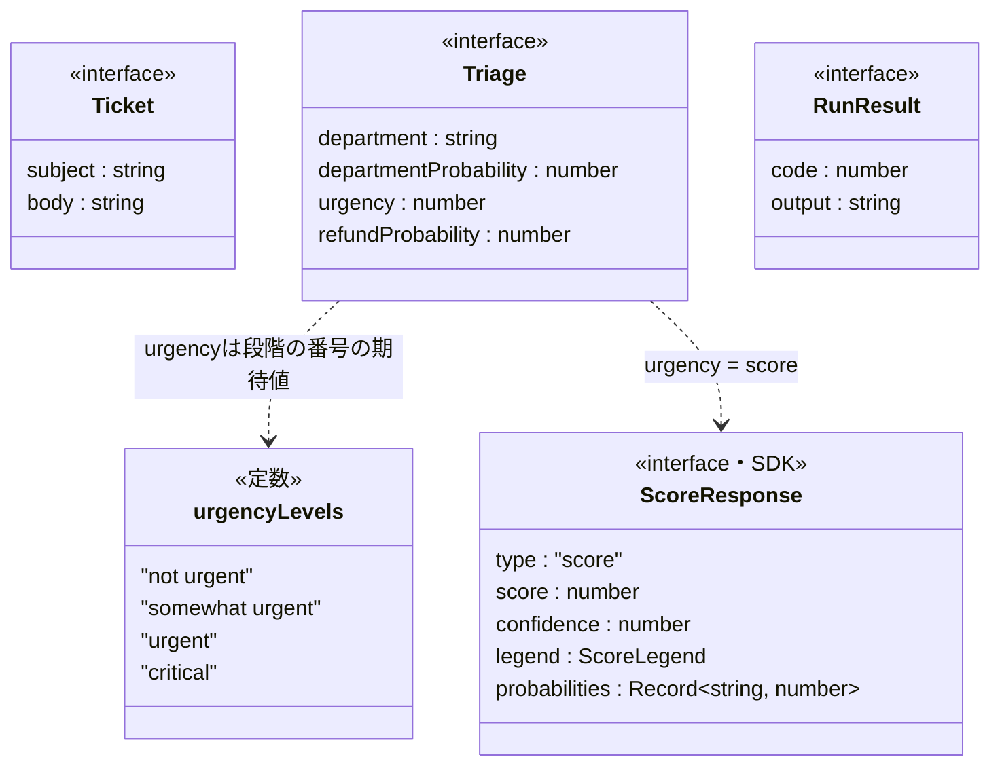

# Code：型と関数

モジュールの中の型と関数を示す．

## 型と関数の流れ

コマンドライン引数から表示する文字列までを，型の変換の流れで示す．

`triage`の中では，3つの質問を1回で送り，答えから`Triage`を作る．

`formatTriage`は，`Triage`の項目ごとに1行を作り，改行でつなぐ．

- 担当部署は，もっとも確からしい部署と，その部署の確率を表示する．
- 緊急度は，期待値(`score`)を四捨五入した番号の段階の名前と，期待値を小数第1位まで表示する．
- 返金は，確率が0.5以上なら`yes`，それ以外は`no`と表示する．
- 確率は小数第2位までに丸める．

## 主な型

自分で定義した型と定数を示す．判断エンジンに送る質問は，SDKの型(`ChoiceQuestion`・`ScoreQuestion`・`NoulQuestion`)の定数として`triage.ts`の中に持つ．

- `urgencyLevels`は，緊急度の質問の`criteria`と，`formatUrgency`の段階の名前の両方に使う．
