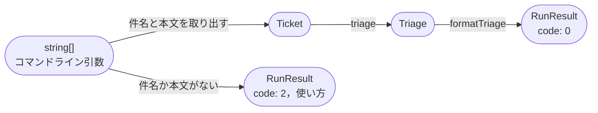
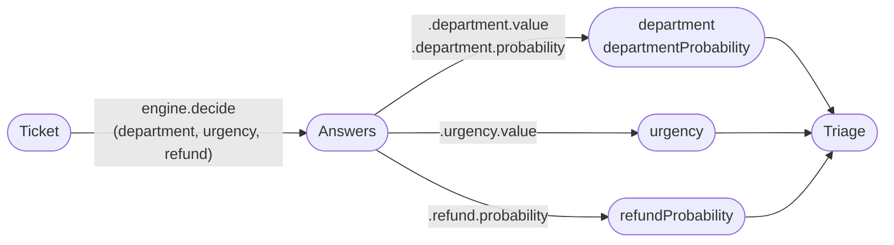
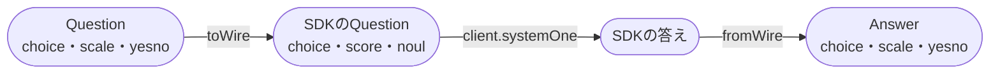
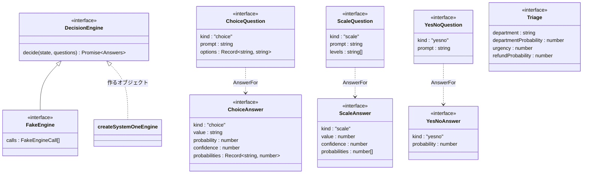

# Code：型と関数

モジュールの中の型と関数を示す．

## 型と関数の流れ

コマンドライン引数から表示する文字列までを，型の変換の流れで示す．

`triage`の中では，アプリの質問を`DecisionEngine`に渡し，答えから`Triage`を作る．

`adapters/systemone-engine`は，アプリの質問と答えを，`/v1/systemone`の質問と答えに変換する．

- `formatTriage`は，`Triage`の項目ごとに1行を作り，改行でつなぐ(Iteration 2と同じ)．
- 緊急度は，期待値を四捨五入した番号の段階の名前と，期待値を小数第1位まで表示する．返金は，確率が0.5以上なら`yes`とする．確率は小数第2位までに丸める．

## 主な型

ポート(`ports/decision-engine`)の型と，アプリの型を示す．

- `Answers<Q>`は，質問の名前ごとに，その質問の種類に対応する答え(`AnswerFor`)を持つ型である．
- `Ticket`・`RunResult`・`urgencyLevels`は，Iteration 2と同じである．
