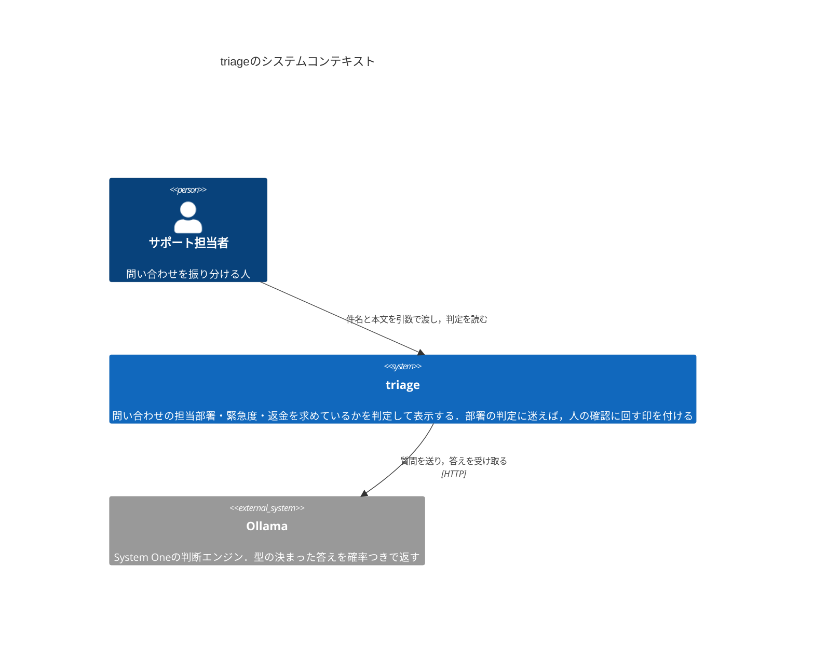

# Context：システムコンテキスト

`triage`を使う人と，`triage`が使う外部のシステムの関係を示す．

```mermaid
C4Context
  title triageのシステムコンテキスト
  Person(user, "サポート担当者", "問い合わせを振り分ける人")
  System(triage, "triage", "問い合わせの担当部署・緊急度・返金を求めているかを判定して表示する．部署の判定に迷えば，人の確認に回す印を付ける")
  System_Ext(engine, "Ollama", "System Oneの判断エンジン．型の決まった答えを確率つきで返す")
  Rel(user, triage, "件名と本文を引数で渡し，判定を読む")
  Rel(triage, engine, "質問を送り，答えを受け取る", "HTTP")
```
