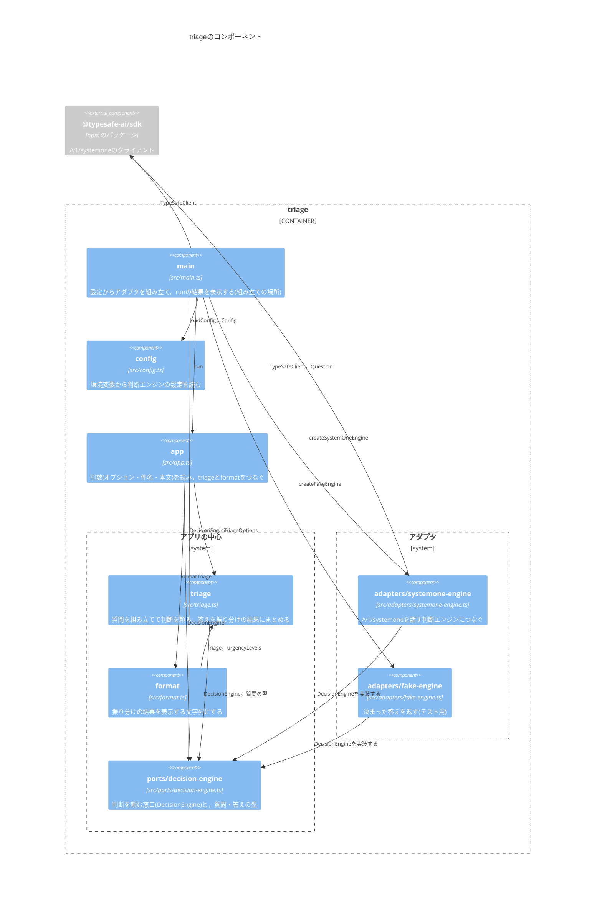

# Component：モジュール

`triage`を構成するモジュール(`src/`のファイル)と，使う外部のパッケージと，その依存関係を示す．

- アプリの中心(`triage`・`format`・`ports/decision-engine`)は，SDKとアダプタのどちらにも依存しない．
- アダプタは，ポートの`DecisionEngine`を実装する．依存の矢印は，アダプタからポートへ向く(依存性の逆転)．
- どのアダプタを使うかを決めるのは`main`だけである．`main`は，`config`が読んだ設定に従ってアダプタを作る．
- `adapters/fake-engine`は，テストと，`DECISION_ENGINE=fake`のときに使う．
- `config`は，ほかのモジュールに依存しない．
