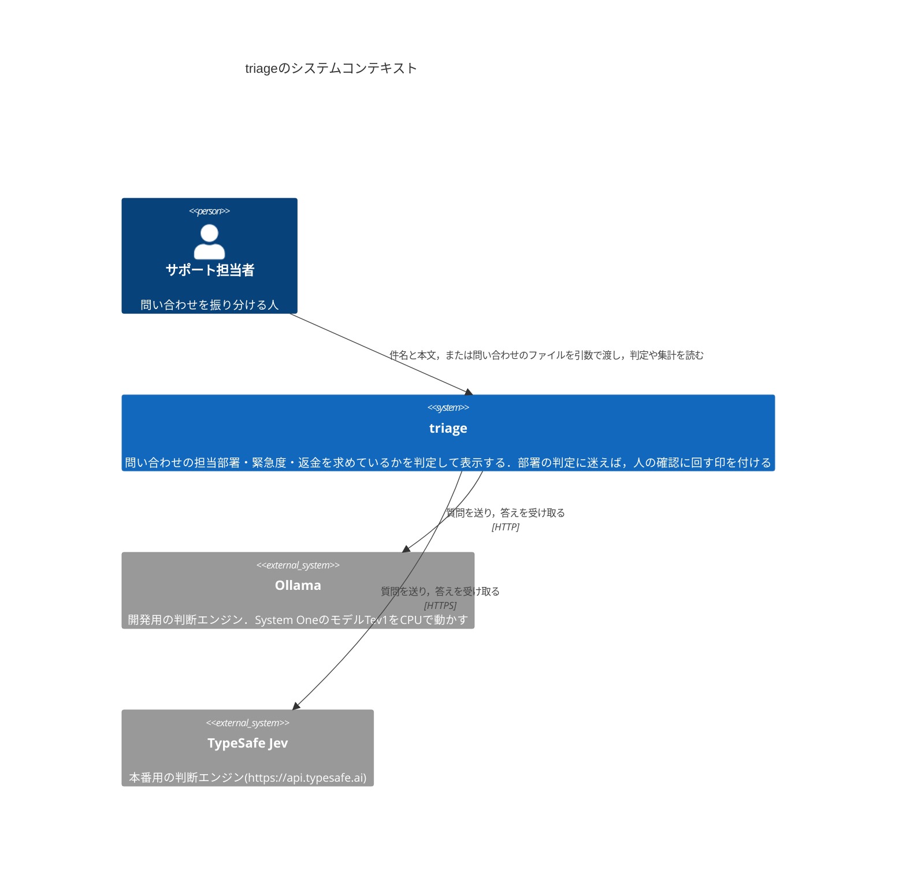

# Context：システムコンテキスト

`triage`を使う人と，`triage`が使う外部のシステムの関係を示す．

```mermaid
C4Context
  title triageのシステムコンテキスト
  Person(user, "サポート担当者", "問い合わせを振り分ける人")
  System(triage, "triage", "問い合わせの担当部署・緊急度・返金を求めているかを判定して表示する．部署の判定に迷えば，人の確認に回す印を付ける")
  System_Ext(ollama, "Ollama", "開発用の判断エンジン．System OneのモデルTev1をCPUで動かす")
  System_Ext(jev, "TypeSafe Jev", "本番用の判断エンジン(https://api.typesafe.ai)")
  Rel(user, triage, "件名と本文，または問い合わせのファイルを引数で渡し，判定や集計を読む")
  Rel(triage, ollama, "質問を送り，答えを受け取る", "HTTP")
  Rel(triage, jev, "質問を送り，答えを受け取る", "HTTPS")
```

- `triage`が使う判断エンジンは，どちらか1つである．どちらを使うかは，環境変数で決める．
