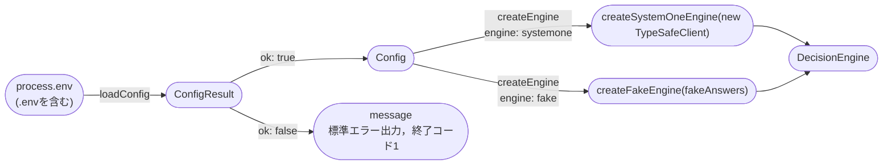
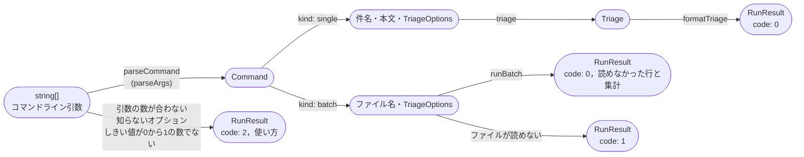
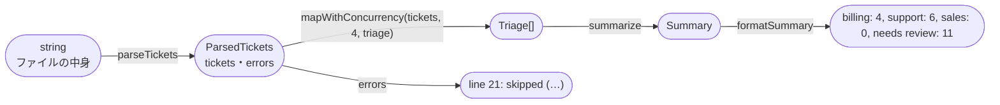
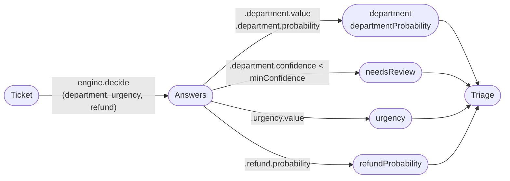

# Code：型と関数

モジュールの中の型と関数を示す．

## 型と関数の流れ

`main`は，環境変数から判断エンジンを組み立てる．

- `DECISION_ENGINE`がないときは`systemone`とする．`systemone`のときは，`SYSTEMONE_BASE_URL`・`SYSTEMONE_MODEL`・`SYSTEMONE_API_KEY`がすべて必要である．空の値は，ないものとして扱う．

コマンドライン引数から表示する文字列までを，型の変換の流れで示す．

`runBatch`は，ファイルの中身から集計までを次のように作る．

- 空の行は飛ばす．JSONとして読めない行や，`subject`と`body`が文字列でない行は，行番号とともに知らせて飛ばす．
- 判断エンジンには，同時に`batchConcurrency`(4)件まで送る．結果は，ファイルの順に並べる．
- 集計では，人の確認に回したものを部署の件数に含めない．部署は`departmentNames`の順に並べる．

`triage`の中では，アプリの質問を`DecisionEngine`に渡し，答えから`Triage`を作る．

`adapters/systemone-engine`は，アプリの質問と答えを，`/v1/systemone`の質問と答えに変換する．

- `formatTriage`は，`Triage`の項目ごとに1行を作り，改行でつなぐ．`needsReview`なら，部署の行の末尾に空白と`-> needs review`を付ける．
- しきい値(`minConfidence`)は，`--min-confidence`で指定する．指定しなければ`defaultMinConfidence`(0.2)を使う．確信度がしきい値ちょうどなら，人の確認に回さない．
- 緊急度は，期待値を四捨五入した番号の段階の名前と，期待値を小数第1位まで表示する．返金は，確率が0.5以上なら`yes`とする．確率は小数第2位までに丸める．

## 主な型

ポート(`ports/decision-engine`)の型と，アプリの型を示す．

```mermaid
classDiagram
  class DecisionEngine {
    <<interface>>
    decide(state, questions) Promise~Answers~
  }
  class ChoiceQuestion {
    <<interface>>
    kind : "choice"
    prompt : string
    options : Record~string, string~
  }
  class ScaleQuestion {
    <<interface>>
    kind : "scale"
    prompt : string
    levels : string[]
  }
  class YesNoQuestion {
    <<interface>>
    kind : "yesno"
    prompt : string
  }
  class ChoiceAnswer {
    <<interface>>
    kind : "choice"
    value : string
    probability : number
    confidence : number
    probabilities : Record~string, number~
  }
  class ScaleAnswer {
    <<interface>>
    kind : "scale"
    value : number
    confidence : number
    probabilities : number[]
  }
  class YesNoAnswer {
    <<interface>>
    kind : "yesno"
    probability : number
  }
  class FakeEngine {
    <<interface>>
    calls : FakeEngineCall[]
  }
  class ParsedTickets {
    <<interface>>
    tickets : Ticket[]
    errors : string[]
  }
  class Summary {
    <<interface>>
    departments : Record~string, number~
    needsReview : number
  }
  class Config {
    <<type>>
    engine : "systemone" | "fake"
    baseURL : string
    model : string
    apiKey : string
  }
  class ConfigResult {
    <<type>>
    ok : true，config : Config
    ok : false，message : string
  }
  class TriageOptions {
    <<interface>>
    minConfidence? : number
  }
  class Triage {
    <<interface>>
    department : string
    departmentProbability : number
    needsReview : boolean
    urgency : number
    refundProbability : number
  }
  ConfigResult --> Config : config
  DecisionEngine <|-- FakeEngine
  DecisionEngine <|.. createSystemOneEngine : 作るオブジェクト
  ChoiceQuestion ..> ChoiceAnswer : AnswerFor
  ScaleQuestion ..> ScaleAnswer : AnswerFor
  YesNoQuestion ..> YesNoAnswer : AnswerFor
```

- `Answers<Q>`は，質問の名前ごとに，その質問の種類に対応する答え(`AnswerFor`)を持つ型である．
- `Config`は，`engine`が`systemone`のときだけ`baseURL`・`model`・`apiKey`を持つ．
- `Ticket`・`RunResult`・`urgencyLevels`は，Iteration 2と同じである．
- `app`の中の`Command`は，`parseCommand`が引数から作る，件名・本文・`TriageOptions`の組である．
