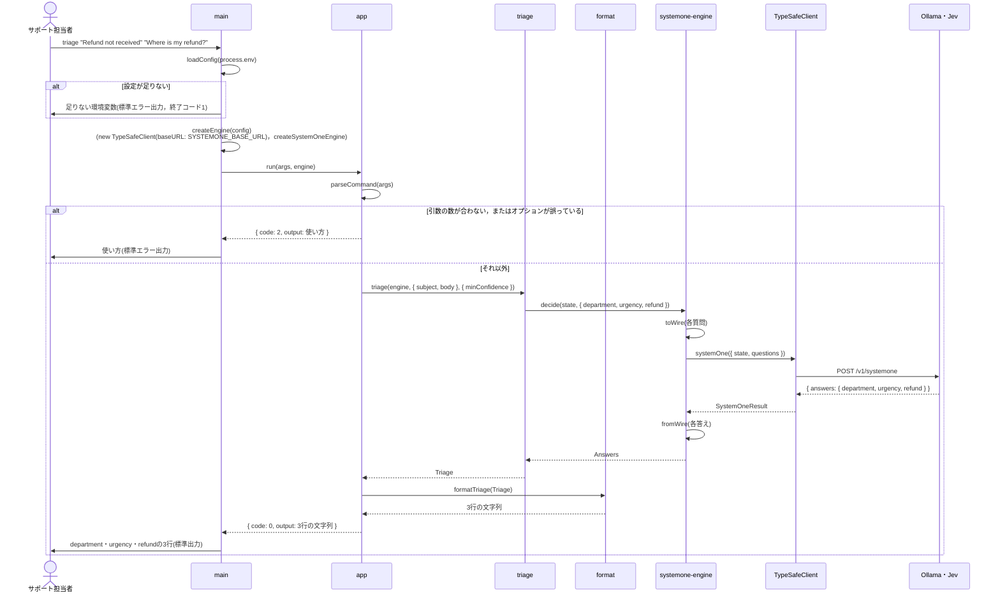
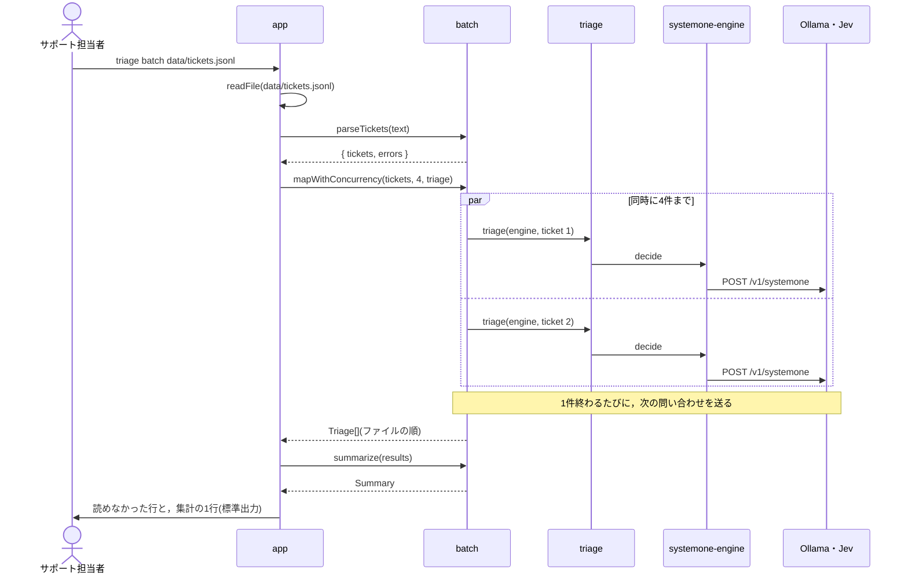

# シーケンス：呼び出しの順序

利用者が`triage`を実行してから結果が表示されるまでの，呼び出しの順序を示す．

`triage batch`では，ファイルの問い合わせを同時に4件まで判断エンジンに送る．

`triage eval`も，同じ流れで問い合わせを送る．
`parseTickets`の代わりに`parseLabeledTickets`で正解の部署ごと読み，`summarize`の代わりに`evaluate`・`confusionMatrix`(または`sweep`)で評価する．
