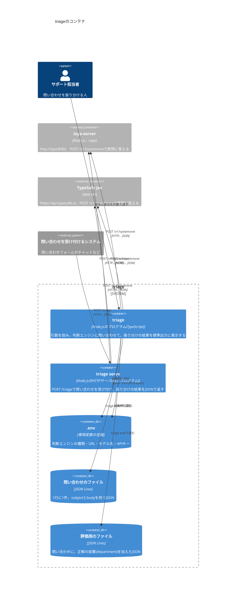

# Container：コンテナ

`triage`を構成する，別々に動くものとデータの置き場所を示す．

- 1件の問い合わせにつき，判断エンジンに1回だけ問い合わせる．3つの質問は，同じリクエストで送る．
- `triage batch`と`triage eval`は，ファイルの問い合わせを同時に4件まで判断エンジンに送る．
- シェルで設定した環境変数は，`.env`の値より優先される．
- `.env`はGitに入れない．見本は`.env.example`にある．
- `triage serve`は，`triage`と同じプログラムを，HTTPサーバとして起動したものである．ポートは`--port`で指定する(既定3000)．
